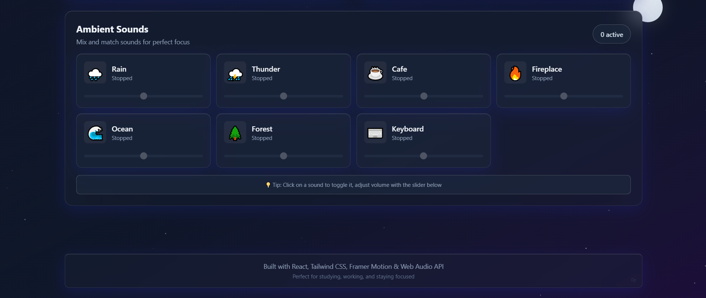
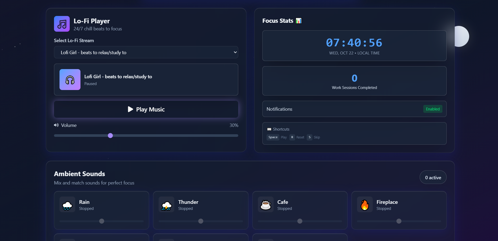
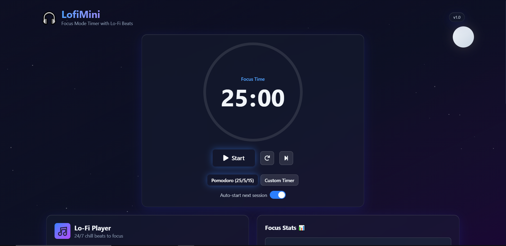

<div align="center">

# 🎧 LofiMini

### *Your Ultimate Focus Companion*

<p align="center">
  <strong>A modern productivity app combining Pomodoro timer, lo-fi beats, and ambient sounds<br/>with stunning glassmorphism UI</strong>
</p>

<p align="center">
  <a href="#-features">Features</a> •
  <a href="#-demo">Demo</a> •
  <a href="#-installation">Installation</a> •
  <a href="#-usage">Usage</a> •
  <a href="#-tech-stack">Tech Stack</a> •
  <a href="#-contributing">Contributing</a>
</p>

<p align="center">
  
  
  
  
</p>

<p align="center">
  
  
  
</p>

---



</div>

## 🌟 Highlights

<table>
<tr>
<td width="50%">

### 🎯 Smart Timer System
- **Dual Modes**: Pomodoro (25/5/15) & Custom
- **Auto-Start**: Seamless session transitions
- **Progress Ring**: Beautiful circular progress
- **Session Counter**: Track your productivity

</td>
<td width="50%">

### 🎵 Immersive Audio
- **5 Lo-Fi Streams**: Curated YouTube channels
- **7 Ambient Sounds**: Procedurally generated
- **Sound Mixer**: Mix multiple ambiences
- **Volume Control**: Individual sound levels

</td>
</tr>
</table>

---

## ✨ Features

### 🎯 **Pomodoro Timer**

<details>
<summary><b>Click to expand</b></summary>

- ⏱️ **Dual Timer Modes**
  - **Pomodoro Standard**: 25 min work / 5 min break / 15 min long break
  - **Custom Timer**: Set your own work/break intervals

- 🔄 **Auto-Start Next Session** (toggleable)
  - Automatically transition between work and break sessions
  - Perfect for deep focus sessions

- 📊 **Circular Progress Ring**
  - Smooth SVG animations with Framer Motion
  - Color-coded states (work: blue, break: green, long break: purple)
  - Real-time progress visualization

- 🔢 **Session Counter**
  - Tracks completed work sessions
  - Determines long break timing (every 4 sessions)
  - Animated flip effect on digit change

- ⏰ **Live Clock Display**
  - Shows current time in your locale
  - Updates every second

</details>

---

### 🎵 **YouTube Lo-Fi Player**

<details>
<summary><b>Click to expand</b></summary>

#### Featured Streams:
1. 🎸 **Lofi Girl** - beats to relax/study to
2. 🌙 **ChilledCow** - lofi hip hop music
3. 🎹 **Chillhop Music** - jazzy & lofi hip hop beats
4. 🌊 **Steezyasfuck** - lofi hip hop radio
5. 🎧 **College Music** - 24/7 lofi hip hop

#### Features:
- 🎛️ **Stream Selector** - Dropdown with all available streams
- 🔊 **Volume Control** - Smooth slider (0-100%)
- ▶️ **Play/Pause** - Instant playback control
- 🎨 **Glassmorphism UI** - Modern frosted glass effect

</details>

---

### 🌧️ **Ambient Sounds Mixer**

<details>
<summary><b>Click to expand</b></summary>

#### 🎼 **7 Procedurally Generated Sounds** (Zero Audio Files!)
All sounds are generated in real-time using the **Web Audio API**:

| Sound | Icon | Description |
|-------|------|-------------|
| **Rain** | 🌧️ | Gentle rainfall with randomized droplets |
| **Thunder** | ⛈️ | Distant thunder rumbles |
| **Cafe** | ☕ | Coffee shop ambience with chatter |
| **Fireplace** | 🔥 | Crackling fire sounds |
| **Ocean** | 🌊 | Soothing wave sounds |
| **Forest** | 🌲 | Birds and nature ambience |
| **Keyboard** | ⌨️ | Mechanical keyboard typing |

#### Features:
- 🎚️ **Individual Volume Sliders** - Fine-tune each sound
- 🔀 **Mix Multiple Sounds** - Layer up to 7 sounds simultaneously
- 🌊 **Animated Wave Visualizer** - Real-time audio visualization
- 🎨 **Interactive Cards** - Click to toggle sounds on/off
- 💾 **No Audio Files** - 100% procedural generation

**Technical Implementation:**
```javascript
// Rain: White noise filtered through bandpass
// Thunder: Low-frequency oscillator with gain envelope
// Cafe: Pink noise + random click sounds
// Fireplace: Brownian noise with crackles
// Ocean: Oscillating lowpass filtered noise
// Forest: Highpass noise + chirp generators
// Keyboard: Short noise bursts with click envelope
```

</details>

---

### 🔔 **Browser Notifications**

<details>
<summary><b>Click to expand</b></summary>

- 📬 **Session Complete Alerts**
  - "Time for a break! 🎉" - Work session done
  - "Break's over! Back to work 💪" - Break session done
  - "Time for a long break! 🌟" - Long break time

- 🔊 **Notification Sound**
  - Procedurally generated notification tone
  - Non-intrusive but attention-grabbing

- 🔐 **Permission Handling**
  - Automatic permission request on first use
  - Graceful fallback if denied

</details>

---

### ⌨️ **Keyboard Shortcuts**

<details>
<summary><b>Click to expand</b></summary>

| Key | Action | Description |
|-----|--------|-------------|
| <kbd>Space</kbd> | **Play/Pause** | Start or pause the timer |
| <kbd>R</kbd> | **Reset** | Reset timer to initial state |
| <kbd>S</kbd> | **Skip** | Skip to next session |
| <kbd>Esc</kbd> | **Close Modals** | Close any open dialogs |

> **Note**: Keyboard shortcuts work globally when the app has focus

</details>

---

### UI Components

- **Glassmorphism Cards** - Frosted glass effect with backdrop blur
- **Smooth Animations** - Framer Motion powered transitions
- **Responsive Design** - Works on desktop, tablet, and mobile
- **Dark Mode Native** - Optimized for low-light environments

---

## 🚀 Demo

> 🔗 **Live Demo**: [LofiMini Demo](https://lofimini.vercel.app/)

### 📸 Screenshots

<details open>
<summary><b>Click to view more screenshots</b></summary>

<br/>

<div align="center">

### Lo-Fi Player & Focus Stats

<p><i>YouTube lo-fi player with volume control, live clock, session counter, and keyboard shortcuts</i></p>

---

### Ambient Sounds Mixer

<p><i>7 procedurally generated ambient sounds with individual volume controls - mix and match for perfect focus</i></p>

</div>

</details>

---

## 📦 Installation

### Prerequisites

- **Node.js** (v18 or higher)
- **npm** or **yarn** or **pnpm**

### Quick Start

```bash
# Clone the repository
git clone https://github.com/sleepingindomie/lofimini.git

# Navigate to project directory
cd lofimini

# Install dependencies
npm install

# Start development server
npm run dev
```

**Access at**: http://localhost:5173/

### Build for Production

```bash
# Create optimized production build
npm run build

# Preview production build locally
npm run preview
```

The build output will be in the `dist/` folder.

---

## 📖 Usage

### Getting Started

1. **🎯 Choose Timer Mode**
   - Click the settings icon to switch between Pomodoro and Custom mode
   - Configure your preferred work/break durations

2. **▶️ Start Focusing**
   - Press <kbd>Space</kbd> or click the play button
   - Watch the progress ring fill up
   - Get notified when sessions complete

3. **🎵 Add Background Music**
   - Select a lo-fi stream from the dropdown
   - Adjust volume to your preference
   - Click "Play Music" to start

4. **🌧️ Mix Ambient Sounds**
   - Click on sound cards to activate them
   - Adjust individual volume sliders
   - Create your perfect soundscape

### Pro Tips

- 💡 **Mix & Match**: Combine lo-fi music with rain sounds for ultimate focus
- 🔊 **Volume Balance**: Keep music at ~50% and ambience at ~30% for best results
- ⏰ **Custom Intervals**: Adjust timer to match your natural focus rhythm
- 🔔 **Enable Notifications**: Never miss a break with browser alerts

---

## 🛠️ Tech Stack

<div align="center">

### Frontend Framework


### Styling


### Animation


### Icons


### Audio


</div>

### Dependencies

```json
{
  "react": "^19.1.1",
  "react-dom": "^19.1.1",
  "framer-motion": "^12.23.24",
  "react-youtube": "^10.1.0",
  "react-icons": "^5.5.0",
  "tailwindcss": "^4.1.15"
}
```

---

## 📁 Project Structure

```
lofimini/
├── 📂 src/
│   ├── 📂 components/
│   │   ├── 📂 Timer/
│   │   │   ├── TimerDisplay.jsx      # Main timer component
│   │   │   ├── TimerControls.jsx     # Play/Pause/Reset buttons
│   │   │   ├── TimerSettings.jsx     # Mode selector & config
│   │   │   └── ProgressRing.jsx      # Circular SVG progress
│   │   │
│   │   ├── 📂 Music/
│   │   │   ├── YouTubePlayer.jsx     # YouTube iframe wrapper
│   │   │   └── StreamSelector.jsx    # Stream dropdown
│   │   │
│   │   ├── 📂 AmbientSounds/
│   │   │   ├── SoundMixer.jsx        # Main mixer component
│   │   │   ├── SoundButton.jsx       # Individual sound card
│   │   │   └── VolumeSlider.jsx      # Volume control slider
│   │   │
│   │   ├── 📂 UI/
│   │   │   ├── GlassCard.jsx         # Glassmorphism wrapper
│   │   │   ├── AnimatedButton.jsx    # Animated button component
│   │   │   ├── BackgroundEffect.jsx  # Animated background
│   │   │   └── Toast.jsx             # Notification toast
│   │   │
│   │   └── 📂 Layout/
│   │       └── MainLayout.jsx        # App layout wrapper
│   │
│   ├── 📂 hooks/
│   │   ├── useTimer.js               # Timer logic & state
│   │   ├── useAmbientSound.js        # Sound generation
│   │   ├── useNotification.js        # Browser notifications
│   │   └── useClock.js               # Live clock
│   │
│   ├── 📂 utils/
│   │   ├── soundGenerator.js         # Web Audio API generators
│   │   ├── notificationSound.js      # Notification beep
│   │   └── constants.js              # App constants
│   │
│   ├── App.jsx                       # Root component
│   └── main.jsx                      # App entry point
│
├── 📂 public/
├── index.html                        # HTML template
├── package.json                      # Dependencies
├── vite.config.js                    # Vite configuration
├── tailwind.config.js                # Tailwind configuration
└── README.md                         # You are here!
```

---

## 🧩 Core Components

### Custom Hooks

#### `useTimer()`
Manages all timer logic including:
- Timer countdown mechanism
- Session type tracking (work/break/longBreak)
- Auto-start functionality
- Session counter
- Keyboard shortcuts

```javascript
const {
  timeLeft,
  isRunning,
  currentSession,
  sessionCount,
  toggleTimer,
  resetTimer,
  skipSession
} = useTimer();
```

#### `useAmbientSound(soundType)`
Generates and controls ambient sounds:
- Web Audio API oscillators & noise generators
- Dynamic volume control
- Sound start/stop logic
- Multiple instance management

```javascript
const { playSound, stopSound, setVolume } = useAmbientSound('rain');
```

#### `useNotification()`
Handles browser notifications:
- Permission management
- Notification display
- Custom messages per session type

```javascript
const { requestPermission, showNotification } = useNotification();
```

---

## 🎯 Technical Highlights

### 1. **Procedural Sound Generation**
No audio files! All ambient sounds are generated using the Web Audio API:
- **Oscillators** for tone generation
- **Noise generators** for natural sounds
- **Filters** for sound shaping
- **Gain nodes** for volume control

### 2. **Performance Optimizations**
- React 19 with automatic batching
- Framer Motion layout animations
- Memoized components with `React.memo`
- Efficient re-renders with proper dependency arrays

### 3. **Responsive Design**
- Mobile-first approach
- Tailwind CSS utility classes
- Breakpoint-based layouts
- Touch-friendly controls

### 4. **State Management**
- React Hooks for local state
- Custom hooks for shared logic
- No external state library needed

---

## 🌐 Browser Compatibility

| Browser | Version | Support |
|---------|---------|---------|
| Chrome | 90+ | ✅ Full |
| Firefox | 88+ | ✅ Full |
| Safari | 14+ | ✅ Full |
| Edge | 90+ | ✅ Full |
| Opera | 76+ | ✅ Full |

**Required APIs:**
- Web Audio API
- Notifications API
- localStorage API
- ES6+ JavaScript

---

## 🚢 Deployment

### Vercel (Recommended)

```bash
# Install Vercel CLI
npm i -g vercel

# Deploy
vercel
```

Or use the Vercel GitHub integration for automatic deployments.

### Netlify

```bash
# Build the project
npm run build

# Deploy
netlify deploy --prod --dir=dist
```

### Manual Deployment

```bash
# Build
npm run build

# Upload the dist/ folder to your hosting provider
```

### Environment Variables

No environment variables required! The app runs entirely client-side.

---

## 🔧 Configuration

### Customize Timer Defaults

Edit `src/utils/constants.js`:

```javascript
export const TIMER_MODES = {
  POMODORO: {
    work: 25 * 60,      // 25 minutes
    break: 5 * 60,      // 5 minutes
    longBreak: 15 * 60  // 15 minutes
  },
  CUSTOM: {
    work: 45 * 60,      // Customize here
    break: 10 * 60,
    longBreak: 20 * 60
  }
};
```

### Add More Lo-Fi Streams

Edit `src/components/Music/StreamSelector.jsx`:

```javascript
const STREAMS = [
  { id: 1, name: 'Your Stream Name', videoId: 'YOUTUBE_VIDEO_ID' },
  // Add more streams here
];
```

### Customize Colors

Edit `tailwind.config.js`:

```javascript
module.exports = {
  theme: {
    extend: {
      colors: {
        primary: '#3b82f6',    // Change primary color
        secondary: '#a78bfa',  // Change secondary color
        accent: '#06b6d4'      // Change accent color
      }
    }
  }
}
```

---

## 🤝 Contributing

Contributions are welcome! Here's how you can help:

### Ways to Contribute

- 🐛 **Report Bugs** - Open an issue with detailed reproduction steps
- 💡 **Suggest Features** - Share your ideas in the issues tab
- 🔧 **Submit PRs** - Fix bugs or add features
- 📖 **Improve Docs** - Help make documentation clearer
- 🎨 **Design** - Suggest UI/UX improvements

### Development Workflow

1. **Fork the repository**
2. **Create a feature branch**
   ```bash
   git checkout -b feature/amazing-feature
   ```
3. **Make your changes**
4. **Commit with conventional commits**
   ```bash
   git commit -m "feat: add amazing feature"
   ```
5. **Push to your fork**
   ```bash
   git push origin feature/amazing-feature
   ```
6. **Open a Pull Request**

### Commit Convention

- `feat:` - New feature
- `fix:` - Bug fix
- `docs:` - Documentation changes
- `style:` - Code style changes (formatting, etc.)
- `refactor:` - Code refactoring
- `test:` - Adding tests
- `chore:` - Maintenance tasks

---

## 🐛 Troubleshooting

<details>
<summary><b>YouTube Player Not Loading</b></summary>

**Symptoms**: Black screen or error in music player

**Solutions**:
- Try a different stream from the dropdown
- Check your internet connection
- Disable browser extensions (adblockers)
- Clear browser cache
- Check browser console for errors

</details>

<details>
<summary><b>Ambient Sounds Not Playing</b></summary>

**Symptoms**: No sound when clicking sound cards

**Solutions**:
- **Web Audio requires user interaction** - Click any sound button first
- Check browser volume settings
- Ensure tab is not muted
- Try refreshing the page
- Check if autoplay is blocked in browser settings

</details>

<details>
<summary><b>Notifications Not Showing</b></summary>

**Symptoms**: Timer completes but no notification

**Solutions**:
- Check browser notification permissions
- Click "Allow" when prompted
- Check system notification settings
- Ensure Do Not Disturb is off
- Try requesting permission again in browser settings

</details>

<details>
<summary><b>Timer Not Starting</b></summary>

**Symptoms**: Play button doesn't start countdown

**Solutions**:
- Check browser console for errors
- Ensure JavaScript is enabled
- Try keyboard shortcut (<kbd>Space</kbd>)
- Refresh the page
- Clear localStorage and try again

</details>

<details>
<summary><b>Slow Performance</b></summary>

**Symptoms**: Laggy animations or high CPU usage

**Solutions**:
- Close other browser tabs
- Disable multiple ambient sounds (max 3-4 recommended)
- Lower YouTube video quality
- Update your browser
- Check task manager for CPU usage

</details>

---

## 📝 Roadmap

### Version 2.0 (Planned)

- [ ] 📊 **Statistics & Analytics**
  - Daily/weekly/monthly productivity charts
  - Session history tracking
  - Focus time heatmap

- [ ] 💾 **Cloud Sync**
  - Save settings across devices
  - Session history backup
  - Custom presets sync

- [ ] 🎨 **Theme System**
  - Multiple color themes
  - Light mode support
  - Custom theme creator

- [ ] 🔊 **More Sounds**
  - White noise
  - Brown noise
  - Pink noise
  - Wind chimes
  - City ambience

- [ ] 👥 **Social Features**
  - Virtual study rooms
  - Focus together mode
  - Leaderboards

- [ ] 📱 **Progressive Web App**
  - Offline support
  - Install as app
  - Push notifications

- [ ] 🌍 **Internationalization**
  - Multi-language support
  - Localized date/time formats

---

## 🎯 Use Cases

Perfect for:

- 👨‍🎓 **Students** - Study sessions with built-in breaks
- 👨‍💻 **Developers** - Deep focus coding sessions
- ✍️ **Writers** - Distraction-free writing time
- 🎨 **Designers** - Creative work with ambient sounds
- 📚 **Researchers** - Long reading sessions
- 🧘 **Anyone** - Boosting productivity with Pomodoro technique

---

## 📄 License

This project is licensed under the **MIT License** - see the [LICENSE](LICENSE) file for details.

```
MIT License

Copyright (c) 2025 LofiMini

Permission is hereby granted, free of charge, to any person obtaining a copy
of this software and associated documentation files...
```

---

## 🙏 Acknowledgments

- **Lofi Girl** - Inspiration for lo-fi integration
- **Pomodoro Technique** - Time management methodology
- **Web Audio API** - Procedural sound generation
- **React Community** - Amazing ecosystem
- **Tailwind CSS** - Utility-first CSS framework
- **Framer Motion** - Animation library

---

## 📧 Contact & Support

<div align="center">

### Got questions or feedback?

[](https://github.com/sleepingindomie/lofimini/issues)
[](https://github.com/sleepingindomie/lofimini)

<!-- Add your social links if needed -->
<!-- [](https://twitter.com/yourusername) -->
<!-- [](https://linkedin.com/in/yourusername) -->

</div>

---

## ⭐ Show Your Support

If you find this project helpful, please consider giving it a star!

[](https://github.com/sleepingindomie/lofimini)
[](https://github.com/sleepingindomie/lofimini/fork)

---

<div align="center">

### 🎧 Stay focused, stay productive, stay lofi

**Built with ❤️ using React, Tailwind CSS, Framer Motion & Web Audio API**

<sub>Version 1.0.0 | Last Updated: October 2025</sub>

---

**[⬆ Back to Top](#-lofimini)**

</div>
